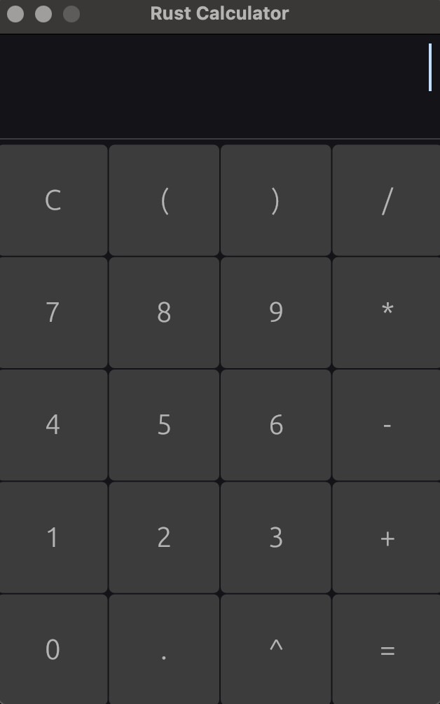

# Rust Calculator

A modern, sleek calculator application built with Rust and egui with full keyboard support.


## Screenshot



## Features

### Modern UI Design

- **Dark Liquid Glass Theme**: Semi-transparent, modern interface with smooth animations
- **Responsive Layout**: Clean 4x5 button grid that fits perfectly in a 320x480 window
- **Visual Feedback**: Buttons light up when pressed, both via mouse clicks and keyboard input

### Full Keyboard Support

- **Number Keys (0-9)**: Direct input
- **Operators**: `+`, `-`, `*`, `/`, `^` (exponent)
- **Parentheses**: `(` and `)` for grouping expressions
- **Special Keys**:
  - `Enter`: Calculate result (=)
  - `Escape`: Clear calculator (C)
  - `Backspace`: Delete last character
  - `.`: Decimal point
  - `%`: Modulo operator

### Advanced Calculations

- Basic arithmetic operations: addition, subtraction, multiplication, division
- Exponentiation with `^` operator
- Parentheses for order of operations
- Decimal number support
- Error handling for invalid expressions and division by zero

### Input Validation

- Only allows valid calculator characters (numbers, operators, parentheses)
- Input length limited to 100 characters
- Real-time filtering of invalid input

## Installation

### Prerequisites

- Rust 1.70 or higher
- Cargo (comes with Rust)

### Building from Source

1. Clone the repository:

```bash
git clone https://github.com/Javijarp/Rust-Calculator.git
cd Rust-Calculator/Rust_Calculator
```

2. Build and run:

```bash
cargo run --release
```

## Usage

### Mouse Input

Simply click the buttons on the calculator to input numbers and operators, then click `=` to calculate the result.

### Keyboard Input

Type directly into the calculator:

- Enter expressions like: `2+2`, `(3+5)*2`, `10^2`, `15/3`
- Press `Enter` to calculate
- Press `Escape` to clear
- Press `Backspace` to delete the last character

### Example Calculations

- Basic: `5 + 3 = 8`
- With parentheses: `(2 + 3) * 4 = 20`
- Exponents: `2^8 = 256`
- Complex: `(10 + 5) * 2 - 3^2 = 21`

## Project Structure

```
Rust_Calculator/
├── src/
│   ├── main.rs              # Application entry point
│   ├── ui.rs                # Calculator UI and logic
│   └── utils/
│       ├── equation_handler.rs  # Expression parser and evaluator
│       ├── helper.rs        # Utility functions
│       └── mod.rs           # Module definitions
├── Cargo.toml               # Project dependencies
└── README.md                # This file
```

## Dependencies

- **eframe** (0.29): Cross-platform GUI framework
- **egui** (0.29): Immediate mode GUI library for Rust

## Technical Details

### Architecture

- **UI Framework**: Built with `egui` for immediate-mode rendering
- **Expression Parsing**: Custom equation handler for mathematical expressions
- **State Management**: Simple struct-based state with `expression` and `result` fields
- **Visual Design**: Custom color scheme with RGBA transparency for glass effect

### Key Features Implementation

1. **Constant Input Focus**: The input field maintains focus automatically
2. **Minimal Padding**: 1px padding between buttons and window edges
3. **Liquid Glass Effect**: Semi-transparent colors with smooth rounding
4. **Input Filtering**: Character-level validation in real-time
5. **Equation Handling**: Full expression evaluation with operator precedence
6. **Keyboard Mapping**: Visual feedback for keyboard shortcuts

## Contributing

Contributions are welcome! Please feel free to submit a Pull Request.

## License

This project is open source and available under the MIT License.

## Author

- GitHub: [@Javijarp](https://github.com/Javijarp)

---
